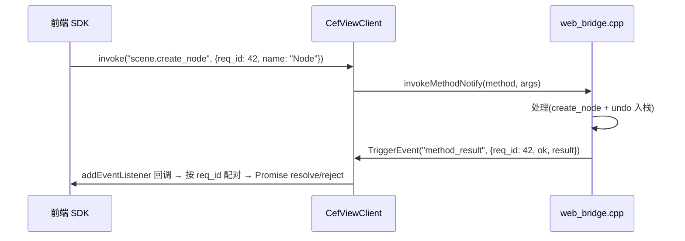

# Godot 编辑器 UI 重构（TS 路线）——Web UI 架构：桥协议与前端 SDK

> **状态**：架构决策已定（2026-08-03）。衔接《C++生态复核与从零选型.md》C0 验证清单、
> 《实施计划-第二日-双向桥与输入交互.md》C 项（协议层落地）。
> **背景**：WebDock 显示链路（C0.1-C0.3）与双向桥（C0.4）已打通；本文件定下"React+Vite
> 前端如何与 Godot C++ 功能交互"的长期架构（MVP3 起）。

---

## 1. 决策摘要（2026-08-03 用户裁决）

| # | 决策点 | 结论 |
|---|---|---|
| 1 | 传输主通道 | **CefViewCore 的 `window.CefViewClient` 桥对象**（`invokeMethod` 方法调用 + `addEventListener` 事件订阅 + C++ 侧 `TriggerEvent` 事件下行）。`cefViewQuery`（CefMessageRouter）**仅因已实现而保留作备用**，后续不应在它身上投入精力，除非出现确实非它不可的场景 |
| 2 | 前端工程目录 | 仓库根新建 **`web/`** workspace（monorepo）：`web/sdk`（TS SDK 包）+ `web/ui`（React+Vite 应用包）。类比 `crates/` 放 Rust 模块的顶层分区 |
| 3 | 协议规范 | **JSON-RPC 风格**：方法/事件用点号命名空间（`scene.create_node`、`editor.selection_changed`），返回统一 `{ ok, result }` / `{ ok:false, error:{code,message} }`；载体 = `invokeMethod(方法名, ...args)` + `TriggerEvent`（非 JSON 字符串） |
| 4 | SDK 形态 | **类型化 API 对象**（`bridge.scene.getNodeCount()`），内部映射到字符串协议；前端组件**永不直接碰** `window.CefViewClient` |

### 1.1 为什么首选 CefViewClient 桥对象（而非 cefViewQuery）

| 能力 | CefViewClient | cefViewQuery | 决策依据 |
|---|---|---|---|
| 方法调用 JS→C++ | ✅ `invokeMethod` | ✅ 内置 | 两者都有 |
| **事件订阅/下行**（C++→JS 推送） | ✅ **原生**（`addEventListener` + `TriggerEvent`） | ❌ 无（仅一问一答） | **React UI 必须**（选中/属性变化推送），cefViewQuery 没有 → 决定性差异 |
| 调用返回值回 JS | ❌ 无内置（**协议层自建**，见 §3.1） | ✅ 内置配对 | 自建成本约 50 行（req_id 配对），换来单通道统一 |
| 悬空清理 | 监听器随 V8 context 释放；invoke fire-and-forget 无悬空 | OnQueryCanceled | 两者都有保障 |
| 通道统一 | 单对象承载 RPC + 事件 | 仅 RPC | SDK 只需封装一个通道，前端心智负担低 |

**结论**：CefViewClient 是唯一同时具备"方法调用 + 事件推送"的通道，是 React 架构的天然主选；
cefViewQuery 缺少事件能力，仅因 C0.4 已打通而保留作备用 RPC，**不作为开发目标**——
新增能力一律落在 CefViewClient 上，cefViewQuery 只在未来出现其独有的确有需要场景（暂未见）时再评估。

---

## 2. 目录结构（`web/` workspace）

```text
web/                          ← workspace root（pnpm）
├── package.json
├── pnpm-workspace.yaml
├── sdk/                      ← @baize/ui-sdk：桥协议 SDK（独立包，多工程复用）
│   ├── package.json
│   └── src/
│       ├── index.ts          ← 导出类型化 API（bridge.scene / bridge.editor / ...）
│       ├── registry.ts       ← defineMethod / defineEvent 声明（类型 ↔ 协议字符串绑定）
│       ├── transport.ts      ← CefViewClient.invokeMethod / addEventListener 封装
│       └── hooks.ts          ← React Hook（useBridge / useEditorEvent；独立子入口，避免 sdk 依赖 React）
└── ui/                       ← @baize/editor-ui：编辑器网页面板（React + Vite，base:'./'）
    ├── package.json
    └── src/
```

**设计理由**：
- 与 `modules/`（C++ 引擎域）、`misc/scripts/` 平级，明确"编辑器 web 前端工程区"；npm 工程
  （node_modules/vite 配置）不污染 C++ 构建域（SCsub 扫源码目录）
- **sdk 独立包**：桥协议是"契约"，未来多个前端工程（编辑器面板、调试工具、文档 demo）共用同一 SDK
- hooks 放 sdk 子入口：sdk 核心不依赖 React（纯 TS），React 绑定独立导入

**与现有代码衔接**：
- `modules/webview/ui/bridge.html`（stub）保留为 MVP 阶段页面；React 壳完成后 `web/ui` 的
  vite 构建产物（`base:'./'`）→ stage 拷到 `bin/webview/ui/`——运行时路径不变，
  `editor_web_dock` 加载逻辑零改动
- 新增 `task ui-build`（vite build → 拷 dist），并入 stage 或独立 task

---

## 3. 协议规范（协议层，C++ 侧 `web_bridge` 实现）

### 3.1 载体（CefViewCore 机制，已确认注入）

- **JS→C++ 方法调用**：`window.CefViewClient.invokeMethod("命名空间.方法", ...args)`
  （V8 值 → CefValue，支持基础类型/对象/数组；宿主回调 `invokeMethodNotify` 目前空实现，待接）
- **JS 订阅事件**：`window.CefViewClient.addEventListener("命名空间.事件", cb)` /
  `removeEventListener`（已注入可用）
- **C++→JS 事件下行**：`CefViewBrowserClient::TriggerEvent`（进程消息 → renderer → JS 监听器回调）
- **结果回报**：`window.__cefview_report_js_result__`（JS 侧主动回报，invoke 返回通道的辅助机制）
- `cefViewQuery`（CefMessageRouter）保留为备用 RPC 通道（C0.4 已打通），**不作为开发目标**（见 §1.1）

### 3.2 invokeMethod 返回通道（自建，协议层职责）

`invokeMethod` 是 **fire-and-forget**（无内置返回值配对）——调用返回值由协议层自建：



- **req_id**：JS 侧生成递增 id，随参数传入（协议层约定为每个调用参数的固定字段）
- **应答事件**：`method_result`（统一名）携带 `{ req_id, ok, result }` / `{ req_id, ok:false, error }`
- **悬空防护**：SDK 侧超时（可配）；监听器随 V8 context 释放自动清理；C++ 侧应答在浏览器
  销毁后静默丢弃（TriggerEvent 失败路径）

### 3.3 方法/事件清单（MVP2 验收场景起步）

**方法（JS→C++）**，返回统一 `{ ok, result }`：

| 方法 | 参数 | 返回 result | 说明 |
|---|---|---|---|
| `scene.get_node_count` | — | `number` | 当前场景节点数 |
| `scene.create_node` | `{ name: string }` | `number` (node_id) | **undo 可撤销**（EditorUndoRedoManager） |
| `editor.undo` | — | `{}` | 撤销上一步 |
| `editor.redo` | — | `{}` | 重做 |

**事件（C++→JS）**：

| 事件 | payload | 说明 |
|---|---|---|
| `editor.selection_changed` | `{ node_paths: string[] }` | 编辑器选中变化（MVP2：帧轮询 diff 或信号） |
| `editor.node_position_changed` | `{ node_id: number, position: {x,y,z} }` | 属性/拖动变化 |
| `editor.undo_stack_changed` | `{ can_undo: bool, can_redo: bool }` | undo 栈状态（可选，MVP2 后） |

**方法名**：小写点号命名空间（`scene.`/`editor.`/`inspector.`），与 C++ 注册表一一对应；
**事件名**：同风格，`*_changed` 后缀表状态推送。

---

## 4. SDK 设计（`web/sdk`）

### 4.1 分层

```text
React 组件
  ↓ bridge.scene.getNodeCount()        类型化 API（camelCase，编译期校验）
SDK 内部
  ↓ "scene.get_node_count"             字符串协议（snake_case 命名空间）
CefViewClient.invokeMethod / TriggerEvent
  ↓
web_bridge.cpp 方法注册表 / 事件源
```

### 4.2 类型化声明（`registry.ts`）

```ts
// 每个方法/事件一处声明：TS 类型 ↔ 协议字符串绑定
const getNodeCount = bridge.defineMethod<[], number>("scene.get_node_count");
const createNode = bridge.defineMethod<[{ name: string }], number>("scene.create_node");
const undo = bridge.defineMethod<[], {}>("editor.undo");
const onSelectionChanged = bridge.defineEvent<{ node_paths: string[] }>("editor.selection_changed");
const onPositionChanged = bridge.defineEvent<{ node_id: number; position: { x: number; y: number; z: number } }>("editor.node_position_changed");

export const scene = { getNodeCount, createNode };
export const editor = { undo, redo: ..., onSelectionChanged, onPositionChanged };
```

### 4.3 前端用法（类型提示完整）

```ts
import { scene, editor } from "@baize/ui-sdk";
// 或 React：import { useBridge } from "@baize/ui-sdk/react";

const count: number = await scene.getNodeCount();
const id: number = await scene.createNode({ name: "BridgeNode" });
const unsub: () => void = editor.onSelectionChanged((e) => setSelection(e.node_paths));
```

- 方法返回统一 Promise（`{ ok:false }` → reject，含 error.code/message）；实现 = `invoke` +
  req_id 配对 `method_result` 应答事件（见 §3.2），超时可配
- 事件返回取消订阅函数；React 侧 `useEditorEvent(event, handler)` 自动清理

### 4.4 决策权衡

| 形态 | 结论 |
|---|---|
| 字符串调用 `bridge.call("scene.get_node_count")` | 协议层用（稳定、跨语言）；前端不直接用（无类型提示） |
| 类型化 API 对象 | SDK 层用（编译期校验、重构安全、事件 payload 类型化） |
| 自动生成 TS 类型（从 C++ 协议定义） | 后话（方法量大了再做生成器）；起步手写声明 |

---

## 5. 实施路径

- **C 项（现在，协议层落地）**：C++ `web_bridge` 接 `invokeMethodNotify`（方法注册表：
  `scene.get_node_count` / `scene.create_node`(undo) / `editor.undo` / `editor.redo`）+ 事件源
  （`TriggerEvent`：`editor.selection_changed`）；stub 页面直接调 `window.CefViewClient.invoke`
  验证（M2 桥命令，对应旧测试页 create_node/undo/count 验收场景）
- **MVP3（React 壳）**：建 `web/` 工程（sdk + ui React 应用）；sdk 先出（含类型化 API），
  ui 消费；vite 构建产物进 `bin/webview/ui/`
- **后续**：方法/事件扩展（inspector.set_prop、下行事件补全）；协议类型自动生成（可选）

## 6. 相关文档

- 《C++生态复核与从零选型.md》§9 C0.4（JS 双向桥）——桥机制来源
- 《实施计划-第二日-双向桥与输入交互.md》——C 项（协议层落地）执行计划
- 《引擎级WebDock-RouteB-方案.md》——MVP2 验收场景（选中/属性双向 + undo）来源
