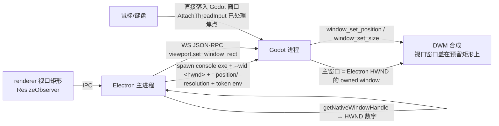
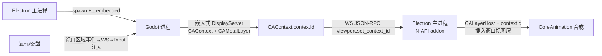
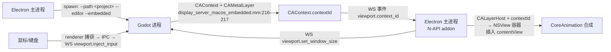

# 视口渲染：窗口嵌入方案设计与验证计划（Win C-lite / Mac M2'）

> 日期：2026-08-07
> 范围：视口呈现在 Electron UI 中的方案定案 + 双平台可行性验证计划。
> 基线：仅基于 2026-08-07 视口方案重抉择结论，**不背负历史路线**（历史方案只出现在 §2 否决记录，不再回退研究）。
> 修订：2026-08-07 放宽 C4 崩溃隔离约束（用户决策：Electron 与 Godot 功能完全融合，同生共死可接受），全文已同步。
> 修订：2026-08-07 定案 Win 几何同步路径 = **(b) fork 放开 policy block**；(a) Electron SetWindowPos addon 弃用；(c) WinEventHook 列为 W2 验收不通过的升级路径（不预建）。
> 修订：2026-08-07 **mac 部署目标定案：仅 Apple Silicon（arm64）+ macOS 15+**；M2' 实施方案见 §5.5（供 Mac 开发同事执行）。
> 修订：2026-08-07 确认 **M3 UI 树抑制暂缓**——嵌入窗口内容 = 完整原生编辑器（并存期形态，D7），C-lite 窗口机制不受影响；仅 3D Viewport 内容留待 M3。
> 修订：2026-08-07 **启动期焦点死锁发现与修复**：上游 `--wid` 嵌入 + splash 期点击 owner 抢焦点 → 双方主线程冻结（A/B 证明与己方代码无关）；修复 = 启动期双 no-focus（Electron `setFocusable(false)` + Godot `--embedded-no-focus`）+ React loading 遮罩，connected + 5s 后双解除。详见实施记录 §4.4。
> 执行前提：Godot 4.8 dev fork（本仓库）+ Electron 43.x；不 fork Chromium/Electron 源码。

---

## 1. 目标与约束

### 1.1 目标

编辑器 3D 视口以"融合 UI"形态呈现在 Electron 主窗口内，Windows / macOS 各自确定可行技术路线并完成可行性验证。

### 1.2 硬约束（本次决策确定）

| # | 约束 | 理由 |
|---|---|---|
| C1 | **不 fork Chromium/Electron 源码**；任何需改 Chromium 源码的方案一律拒绝 | 维护负担（每次版本升级 rebase）不可接受 |
| C2 | 视口 overlay（gizmo/网格/选择框）渲染在 Godot 侧；**HTML 永不覆盖视口**（永久产品约束） | 整体架构方案 §6 已定；由此"像素级融合"（GPU 纹理进网页）动机消失 |
| C3 | 输入直达优先，全转发不作为常态 | OSR 族 16-33ms 转发延迟是结构成本（**mac 例外**：融合 UI 形态下无法满足，见 §5.1） |
| C4（已放宽） | **不强制进程隔离**：Electron 与 Godot 功能完全融合，一起崩溃可接受（用户决策 2026-08-07） | 连带影响见 §1.3 注 |

### 1.3 决策摘要

| 平台 | 路线 | 机制 | 形态 |
|---|---|---|---|
| **Windows** | **C-lite** | Godot 视口窗口 = Electron 主窗口的 **owned window**（复用上游 `--wid`） | 几何同步、输入直达、零帧传输 |
| **macOS** | **M2'（首选）** | CAContext/CALayerHost 远程 layer 托管（复用上游 `--embedded`），Electron 侧原生 addon 承载 | 原生嵌入（mac 版 C-lite）；**仅 Apple Silicon + macOS 15+**（产品决策 2026-08-07，实施见 §5.5） |
| macOS | M3（备选） | Metal → IOSurface → Electron `importSharedTexture` | 离屏帧管线（承担 OSR 族成本） |
| macOS | M1（兜底） | 独立窗口 | MVP 形态 |

两平台同构于统一 `ViewportHost` 抽象：`attach / set_rect / set_visible / set_focused`，机制全部来自本 fork 树，**无 Chromium 改动**。

> **C4 放宽的连带影响（2026-08-07）**：
> - 进程形态不变：Godot 独立进程 + WS（D1）的依据是主循环共存/渲染上下文/编辑器嵌入先例，崩溃隔离不是其成立理由；
> - 方案选择不变：C-lite / M2' 本就不依赖崩溃隔离（原为加分项，现降为可选）；
> - W3 翻转不复活：其余否决理由仍在（见 §2）；
> - 进程内嵌入（LibGodot）不复活：崩溃耦合只是其否决理由之一，双主循环/渲染上下文/编辑器嵌入无先例仍成立。

---

## 2. 否决路线记录（不回退研究）

| 路线 | 否决理由 |
|---|---|
| A 独立窗口 | 任何平台只配 MVP：产品形态问题（两个窗口就是两个窗口），非性能问题 |
| 2A CPU 读回 | 结构性能上限（带宽 + 读回管线同步 + resize 抖动），全平台成立；Apple Silicon 统一内存仅缓解带宽半边 |
| 2B GPU 共享 | ① Win 驱动互操作实测死亡：Vulkan→D3D11 导出组合驱动声明不支持（无 EXPORTABLE_BIT），独立 D3D11 程序同 GPU 上 `OpenSharedResource1`=E_INVALIDARG；② Electron sharedTexture 实验性 API；③ 输入全转发；④ resize 需纹理重分配 + 句柄重换 |
| C-full（SetParent 进 Chromium） | Chromium 敌意宿主：绘制覆盖/闪烁/输入冲突（AttachThreadInput + WndProc 钩子）；上游 Godot 自身选 owned 而非 child，佐证 |
| W3 翻转（Godot 宿主 + Electron 子窗口） | ~~崩溃隔离方向反了~~（C4 已放宽，该理由作废）；仍否决：① Electron BrowserWindow 子窗口模式非官方支持，quirks 影响全 UI（非仅视口面板）；② 应用框架归属颠倒——任务栏/吸附/最小化语义属 Godot 进程，app 身份应属 Electron 壳层；③ 同步成本不减反移（UI 区跟随宿主，同一套 rect 同步） |
| 透明挖孔（透明 Electron 覆盖） | 输入地狱（点按/键盘焦点需转发）+ 平台透明合成惩罚（Win11 / macOS Sequoia）；换来的 HTML-over-viewport 是非需求 |
| WGC / ScreenCaptureKit | 仅"网页内像素"成为硬需求才考虑；多一层合成 + 捕获延迟 +（mac）TCC 录屏权限 |
| WebView2 换壳 | 架构级换血（弃 Electron 主进程/Node 栈），视口机制不变，零收益 |

---

## 3. 机制事实（fork 树内证据，可复核）

### 3.1 Windows：`--wid`（embedded window，owned 语义）

| 环节 | 位置 |
|---|---|
| `--wid <hwnd>` 参数解析 → `init_embed_parent_window_id`，置 `_embedded_in_editor` | main/main.cpp:1984-1992 |
| `--position/--resolution` 提供初始几何；重置窗口标志为 windowed/borderless | main/main.cpp:3233-3236 |
| `DisplayServer::create(..., init_embed_parent_window_id, ...)` | main/main.cpp:3311 |
| 主窗口以 `p_parent_hwnd` 为 **owner** 创建（`WS_POPUP` + parent = owned window，非 WS_CHILD） | platform/windows/display_server_windows.cpp:2585-2586, 7239-7240, 7277 |
| **AttachThreadInput**（输入/焦点同步，创建时即处理） | display_server_windows.cpp:7286-7289 |
| 任务栏/Alt-Tab 抑制（embedded 时不加 `WS_EX_APPWINDOW`） | display_server_windows.cpp:2577-2579 |
| 嵌入式窗口焦点处理（点击激活） | display_server_windows.cpp:5691-5694 |
| 父窗口关闭 → 子窗口自动收尾（WM_WINDOWPOSCHANGED 检测） | display_server_windows.cpp:6733-6736 |
| **policy block**：embedded 窗口禁止自移动/缩放（C-lite 需放开，见 §4.2） | `window_set_position`:2363-2365；`window_set_size`:2503-2505；min/max size:2452-2454, 2478-2480 |
| **官方 spawn 契约**：`--wid <window_get_native_handle(WINDOW_HANDLE)>`（Electron 侧照抄此模式） | editor/run/game_view_plugin.cpp:1363-1365 |

`is_embedded_in_editor` 影响面（2026-08-07 查证）：Windows 上仅 scene/main/window.cpp:1291 的**主窗口 resize 禁令**（恰好符合 C-lite 需要）；其余全部为 Wayland 专属（wayland_thread.cpp:5565, 5626）。`window_set_transient` 仅支持进程内 WindowID 且 exclusive 才设 `GWLP_HWNDPARENT`（display_server_windows.cpp:2440-2442）——**跨进程 owner 挂接唯一路径 = spawn 时 `--wid`**。

### 3.2 macOS：`--embedded`（CAContext/CALayerHost 远程 layer）

| 环节 | 位置 |
|---|---|
| `--embedded` → `EMBEDDED_DISPLAY_DRIVER`（仅 macOS） | main/main.cpp:1441-1447, 294-296 |
| 嵌入式 DisplayServer 创建 **CAContext** + CAMetalLayer/CALayer，把 `contextId` 发给宿主 | platform/macos/display_server_macos_embedded.mm:216-221 |
| 宿主侧用 contextId 建 **CALayerHost** 显示远程 layer | platform/macos/display_server_macos.mm:3213-3217 |
| 机制说明（CAContextID 跨进程传递；CALayerHost 显示对方 layer）——**该注释源自 Chromium，Chromium 自身即用此机制** | platform/macos/macos_quartz_core_spi.h:63-93 |
| 渲染后端现成：Metal + apple_embedded 驱动 | drivers/metal/、drivers/apple_embedded/ |

要点：macOS 跨进程 **NSView** 嵌入不可行（AppKit 语义），但 **CoreAnimation 远程 layer 托管（CAContext/CALayerHost）可行**，且是 Chromium 自身架构；上游 Godot 4.8 官方 embedded game view 即此机制，随官方编辑器发布。

---

## 4. Windows 方案（C-lite）

### 4.1 架构与数据流

- 帧路径：Godot 直接 present 到自己的窗口表面——零拷贝、零传输、零同步。
- 输入路径：鼠标直接命中 Godot 窗口；键盘经 AttachThreadInput（上游已处理）直达。
- 同步路径：renderer 布局 → IPC → 主进程 → WS → Godot 移动/缩放窗口（loopback 亚毫秒，预期 ≤1 帧）。

### 4.2 改动清单

**Godot fork（唯一必改点：放开 embedded 窗口自移动/缩放）**

1. `DisplayServerWindows::window_set_position` 移除 embedded 限制（display_server_windows.cpp:2363-2365 的 `if (wd.parent_hwnd) return;`）；
2. `DisplayServerWindows::window_set_size` 移除 embedded 限制（:2503-2505）；
3. 视需要放开 min/max size 限制（:2452-2454, :2478-2480）；
4. 能力面新增 `viewport.set_window_rect {x,y,w,h}`（底层调 window_set_position/size），走现有 WS 通道（D8 不破）。注：dev 基线 gd_provider 无任何 viewport.* 能力（registry.cpp:53-57 注释明示随里程碑扩展），此为全新注册，按现有 register_method 模式。

> **定案（2026-08-07）**：采用 fork 放开方案——Electron 保持纯 JS，移动/缩放同步闭环留在 Godot 内；Electron 侧 SetWindowPos addon 弃用。若 W2 验收（拖拽 ≤1 帧跟随）不通过，升级路径 = Godot 侧 WinEventHook（`EVENT_OBJECT_LOCATIONCHANGE` 直接跟踪 Electron 窗口，绕过 Electron 事件链），**不预建**。

**Electron（纯 JS，无 addon）**

1. spawn Godot 参数：`--wid <hwnd>`（`getNativeWindowHandle()` 读 64 位指针）、`--position/--resolution` 初始值；
2. renderer：`ResizeObserver` 测量视口预留矩形 → IPC → 主进程 → WS `viewport.set_window_rect`；
3. 主窗口同步：优先用 **`will-move` / `will-resize`**（动作发生前触发）提前摆位，使 Godot 窗口与 Electron 窗口**同帧到达新位置**（消除拖拽感知滞后）；`move`/`resize` 事件兜底；`minimize/maximize` → WS 转发（owned 窗口最小化跟随属自动语义，验证即可）；
4. 生命周期：Godot 崩 → 视口窗口随父销毁（owned 语义）；C4 放宽下应用整体退出可接受。若视口进程重启（复用 ProcessSupervisor）成本低，保留为加分项，不作验收要求。

### 4.3 Win spike 验证项与验收标准

| # | 验证项 | 验收标准 |
|---|---|---|
| W1 | `--wid` + `--editor` 组合启动（`_embedded_in_editor` flag 与编辑器状态机共存） | 编辑器核心正常启动，视口窗口即位于 Electron 预留矩形内（**查证：flag 在 Windows 仅触发主窗口 resize 禁令 scene/main/window.cpp:1291，无其他行为影响，风险低**） |
| W2 | 几何同步：拖动/缩放 Electron 窗口 | 视口跟随无抖动、无黑帧、无拉伸残留；延迟 ≤1 帧（**不过 → 启用升级路径 (c) WinEventHook**，见 §4.2） |
| W3 | 输入直达 | 点击视口后键盘直达（gizmo 快捷键 W/E/R/F、滚轮缩放即时）；UI 与视口间焦点切换无卡顿 |
| W4 | 窗口形态 | 任务栏/Alt-Tab 无第二图标；Electron 最小化视口同隐；关闭 Electron 视口窗口随之销毁 |
| W5 | 崩溃行为（C4 放宽） | kill Godot 进程 → 应用整体退出可接受；若实现 UI 存活 + 视口重启则记录为加分项，不作为验收门槛 |
| W6 | DPI / 多显示器 | 125%/150% 缩放 + 双屏，视口位置/尺寸/像素比正确 |
| W7 | Play 窗口同机制 | `run.play` 游戏进程同样以 `--wid` 嵌入（视口区域显示游戏） |

---

## 5. macOS 方案（M2' 首选 / M3 备选）

### 5.1 M2' 架构（mac 版 C-lite）

- 帧路径：Godot 渲染到 CAMetalLayer（CAContext 远程 layer）→ CoreAnimation 直接合成到窗口——零拷贝、零传输。
- 输入路径：**宿主转发（重要修正 2026-08-07）**——CAContext 远程 layer 不是 NSView，**无法接收原生事件**；上游游戏侧经 `EmbeddedDebugger::_msg_event` 注入（embedded_debugger.h:59-66）。Electron 捕获视口区域事件 → WS → Godot 注入（同 OSR 族 16-33ms）。**mac 融合 UI 的输入转发是结构成本，C3 仅 Windows 可满足；M1 独立窗口是 mac 唯一输入直达形态**。
- Godot 侧机制现成（`--embedded` + display_server_macos_embedded + drivers/apple_embedded）；上游 contextId 经调试协议发送（game_view:set_context_id），**我们改走现有 WS 通道**（小适配）。

### 5.2 改动清单

**M2'**

- Godot：确认编辑器核心视口窗口走嵌入式 DisplayServer 的创建路径；contextId 上报从调试协议改为 WS（`viewport.set_context_id` 事件）。**部署目标：仅 Apple Silicon + macOS 15+**（2026-08-07 产品决策；技术下限 Electron 43 = macOS 13，electron/BUILD.gn:53-56，不构成约束）。详细实施方案见 §5.5。
- Electron：N-API addon（约 50-100 行，允许——禁区仅限 Chromium 源码）：接收 contextId → `[CALayerHost layer]` + `contextId` 赋值（对照 display_server_macos.mm:3213-3217）→ 插入 BrowserWindow 视图层级。

**M3（备选）**

- Godot：Metal 后端（drivers/metal 现成）新增 IOSurface 导出：`IOSurfaceCreate` + `CVMetalTextureCacheCreateTextureFromImage` → MTLTexture 作为视口渲染目标（参考 drivers/apple_embedded 模式）。
- Electron：复用 2B 遗留接线（`importSharedTexture → sendSharedTexture → getVideoFrame → canvas`），handle 来源从 D3D11 NT handle 换 IOSurface；输入全转发（`inject_input` 已有能力）。
- **跨进程交接约束（B1 源码查证，2026-08-07）**：`importSharedTexture` 要求 handle 在调用进程（Electron 主进程）内有效（electron_api_shared_texture.cc:586-589、shared_texture/README.md:15-17 原文）。IOSurfaceRef 是进程内指针，**不能像 NT handle 那样按 uint64 值经 WS 跨进程传递**；交接需 mach_port send right（新增 mach IPC 通道）或已废弃但可用的 `kIOSurfaceIsGlobal` 全局 ID → `IOSurfaceLookup`。即 M3 的跨进程交接成本高于 2B 直搬，该事实强化 M2' 首选地位。

### 5.3 Spike A（M2'）验证项与决策标准

| # | 验证项 | 风险等级 |
|---|---|---|
| A1 | CALayerHost 插入后可见性 / z-order（**是否被 Chromium 重绘覆盖**） | **决定性（最大风险）** |
| A2 | **输入转发闭环**（点击 / 键盘 / IME / 滚轮经 WS 注入；验收 ≤2 帧）——CAContext 远程 layer 无原生事件，转发为结构成本 | 高 |
| A3 | 窗口缩放 / 移动跟随（CA 原生合成） | 中 |
| A4 | 部署 macOS 15 上 CAContext/CALayerHost 可用性（fork 以 SPI 声明，macos_quartz_core_spi.h:63-93；**部署目标 = Apple Silicon + macOS 15+**；dev tool 直接分发无碍，App Store 需另行评估） | 中 |
| A5 | 全屏 / 多显示器 / Spaces / Mission Control 行为 | 低 |

**决策：A1+A2 通过 → M2' 定案**（mac 与 Win 同构，均为原生嵌入，无 OSR 族成本）。

### 5.4 Spike B（M3）验证项与决策标准

| # | 验证项 |
|---|---|
| B1 | **零成本先行**：本地 Electron 源码（`D:\misutime\104_game\electron`）grep `importSharedTexture` 的 IOSurface 支持路径与格式 |
| B2 | Godot Metal → IOSurface 渲染正确性（像素读回验证） |
| B3 | 端到端帧率 / 输入延迟（转发 16-33ms 的接受度评估） |
| B4 | resize 行为（IOSurface 重分配 churn——OSR 族已知成本） |

**决策：Spike A 不通过 → 执行 Spike B；B 通过 → M3 定案（承担输入转发 + 实验性 API 成本）；B 不通过 → M1 独立窗口（mac MVP 兜底）。**

### 5.5 M2' 实施方案（供 Mac 开发同事执行，2026-08-07 定案）

**部署目标**：仅 **Apple Silicon（arm64）+ macOS 15+**（产品决策 2026-08-07）。技术下限（Electron 43 = macOS 13，electron/BUILD.gn:53-56）远低于产品目标；CAContext/CALayerHost 在 macOS 15 上的可用性由 Spike A4 实测确认。

**总数据流**：

**Godot 侧改动（fork）**：

1. 构建确认：mac 构建默认启用 apple_embedded 驱动（drivers/apple_embedded/，查 SCsub）；`--embedded` 由 main.cpp:1441-1447 门控（仅 MACOS_ENABLED），应默认可用；
2. contextId 上报改走 WS：display_server_macos_embedded.mm:220-221 的 `EngineDebugger::send_message("game_view:set_context_id")` → Provider 新增**事件** `viewport.context_id`（复用现有 Events 机制，Godot→Electron notification）；
3. 尺寸接收：对照 `EmbeddedDebugger::_msg_window_size`（embedded_debugger.h:59）→ Provider 新增 `viewport.set_window_size {w,h}`（调嵌入式 DisplayServer 渲染尺寸）；
4. 输入注入：对照 `EmbeddedDebugger::_msg_event / _msg_ime_update / _msg_win_event`（embedded_debugger.h:62-64）→ Provider 新增 `viewport.inject_input`（事件格式与上游调试协议对齐，参考 embedded_game_view_plugin.mm 的 cursor/mouse 消息对）；
5. 视口窗口创建路径确认：editor-core 以 `--editor --embedded` 启动时，视口渲染走嵌入式 DisplayServer（与 Win 的 `--wid` + 独立窗口不同——mac 上嵌入式 DisplayServer 整体作为显示服务）。

**Electron 侧改动**：

1. N-API addon（macOS 专属原生子包）：`win.getNativeWindowHandle()` → NSWindow → contentView 插入 NSView 容器（承载 CALayerHost）；CALayerHost 声明对照 macos_quartz_core_spi.h:84-86；
2. spawn 参数：mac 分支 `--embedded`（Win 分支保持 `--wid`）+ `--position/--resolution` 初始尺寸；
3. 输入捕获：renderer 视口区域 pointer/keyboard/IME → IPC → 主进程 → WS `viewport.inject_input`；
4. 尺寸同步：ResizeObserver + 窗口事件 → WS `viewport.set_window_size`（远程 layer 无窗口，尺寸 = 渲染目标尺寸，位置由 hostView 决定）。

**坐标契约**：尺寸与输入均按物理像素（Retina scaleFactor 2x/3x 换算）；输入注入前按嵌入式 DisplayServer 坐标系换算（对照 `EmbeddedDebugger._msg_event` 参数语义）。

**Spike A 执行顺序**：A1（可见性/z-order，**决定性**）→ A2（输入转发闭环 ≤2 帧）→ A3（缩放跟随）→ A4（macOS 15 SPI 可用性）→ A5（全屏/多屏/Spaces）。**A1+A2 通过 → M2' 定案**。

**风险**：A1 Chromium 重绘覆盖（最大，失败降级 M3）；SPI（CGSMainConnectionID 私有 + CALayerHost fork 声明，dev tool 直接分发无碍，MAS 需评估）；输入转发 16-33ms 结构成本（C3 例外已定）；`--embedded` 仅 macOS（main.cpp:1445）。

---

## 6. 分阶段验证计划

| 阶段 | 内容 | 资源 | 产出 |
|---|---|---|---|
| **阶段 0（零成本前置）** | ① 本地 Electron 源码 grep `importSharedTexture` IOSurface 路径（B1，已完成）；② 确认 `--wid`/`--embedded` 在当前 fork 构建可用（已完成）；③ 部署 macOS 最低版本——**已定案：仅 Apple Silicon + macOS 15+**（2026-08-07） | 现有 Win 机器 | B1 结论；构建确认 |
| **阶段 1（Win spike）** | 实施 §4.2 改动 → 跑 W1-W7（**已完成 2026-08-07：W1-W4 实测通过**；W6/W7 延后） | 现有 Win 机器 | Win 验收矩阵 |
| **阶段 2（Mac spike）** | 按 §5.5 实施 → Spike A（M2'）→ 不通过则 Spike B（M3） | 1 台 Mac（**Apple Silicon + macOS 15+**），2-3 天 | mac 决策结论 |
| **阶段 3（收口）** | 按决策标准定案；更新整体架构方案 §6 定案路线 | 0.5 天 | 定案文档更新 |

阶段 0 可与阶段 1 并行；阶段 2 依赖阶段 0 的 B1 结论。

---

## 7. 风险登记

| 风险 | 影响 | 缓解 |
|---|---|---|
| Chromium 重绘覆盖 CALayerHost（A1） | M2' 失败 | Spike A 前置验证；失败降级 M3 |
| `--wid` 与 `--editor` 状态机冲突（`_embedded_in_editor` flag） | Win C-lite 阻塞 | W1 先行验证；必要时 fork 调整 flag 语义（仅 flag 使用点，非渲染层） |
| 驱动/DPI 环境差异（Win） | 视口错位/模糊 | 双方 per-monitor v2 一致 + W6 多 DPI 测试 |
| `importSharedTexture` 实验性 API 变动（M3） | 维护税 | 锁定 Electron 版本 + 变更监控 |
| CAContext/CALayerHost SPI 合规（mac） | App Store 分发受阻 | dev tool 直接分发无碍；MAS 另行评估 |
| 拖拽感知滞后（W2 验收不过） | 融合观感受损 | 升级路径：Godot 侧 WinEventHook 直接跟踪 Electron 窗口（定案，不预建） |
| Win11 圆角/阴影与视口矩形重叠 | 视觉瑕疵 | 视口矩形内缩避开外角（布局规则，非机制问题） |

---

## 8. 附：证据索引

- `--embedded`（仅 macOS）→ EMBEDDED_DISPLAY_DRIVER：main/main.cpp:1441-1447, 294-296
- `--wid` 解析 + `_embedded_in_editor`：main/main.cpp:1984-1992
- embedded 初始几何/标志重置：main/main.cpp:3233-3236
- `DisplayServer::create(..., init_embed_parent_window_id, ...)`：main/main.cpp:3311
- Windows owned 窗口创建（WS_POPUP + parent = owner，非 WS_CHILD）：display_server_windows.cpp:2585-2586, 7239-7240, 7277
- Windows AttachThreadInput：display_server_windows.cpp:7286-7289
- Windows 任务栏/Alt-Tab 抑制：display_server_windows.cpp:2577-2579
- Windows 嵌入式窗口焦点：display_server_windows.cpp:5691-5694
- Windows 父窗口关闭收尾：display_server_windows.cpp:6733-6736
- Windows policy block（C-lite 需放开）：window_set_position:2363-2365 / window_set_size:2503-2505 / min-max:2452-2454, 2478-2480
- macOS CAContext + CAMetalLayer + contextId 上报：display_server_macos_embedded.mm:216-221
- macOS CALayerHost 宿主：display_server_macos.mm:3213-3217
- CAContext/CALayerHost 机制说明（源自 Chromium）：macos_quartz_core_spi.h:63-93
- 渲染后端：drivers/metal/、drivers/apple_embedded/
- macOS 部署目标：**仅 Apple Silicon + macOS 15+**（产品决策 2026-08-07）；技术下限 = Electron 43 部署目标 macOS 13.0（electron/BUILD.gn:53-56 硬断言，不构成约束）
