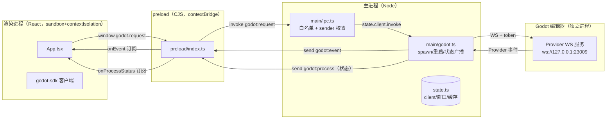

# @baize/app — Baize Editor Electron 应用

baize-godot 编辑器的 Electron 外壳：渲染进程 React UI + 主进程 Godot 进程编排（godot-process 三包）。

总体设计见仓库根 `doc/plans/整体架构-Godot核心-ElectronUI-TSScript-设计方案.md`（§3.0 术语、§5.2 Electron UI 层、§5.4 统一 TS SDK）；本文档描述本包（`web/app/`）的结构、架构与使用方式。

## 目录结构

```
web/app/
├── package.json              # @baize/app；main → dist-electron/main/index.js
├── vite.config.ts            # 单配置构建链：renderer + electronSimple(main/preload)
├── tsconfig.json             # project references 根
├── tsconfig.node.json        # electron/** + src/shared/** + 构建/测试配置
├── tsconfig.web.json         # src/renderer/src + src/shared
├── index.html                # 渲染层 HTML 入口
├── playwright.config.ts      # e2e 配置（testDir: ./e2e）
├── e2e/
│   └── app.spec.ts           # 3 个 e2e：窗口加载 / preload 桥 / 状态面板
├── electron/
│   ├── electron-env.d.ts     # 进程环境变量类型（VSCODE_DEBUG、BAIZE_*）
│   ├── state.ts              # main/ 各模块共享的可变状态（唯一状态源）
│   ├── main/
│   │   ├── index.ts          # 生命周期 + 窗口管理 + 单实例锁
│   │   ├── godot.ts          # Godot spawn / WS 连接 / 受控重启 / 状态下行
│   │   └── ipc.ts            # IPC 桥：白名单 + sender 校验
│   └── preload/
│       └── index.ts          # contextBridge → window.godot（CJS，sandbox 兼容）
├── src/
│   ├── shared/ipc.ts         # 三端共享 IPC 契约（类型 + 通道名唯一来源）
│   └── renderer/src/
│       ├── main.tsx          # React 入口
│       ├── App.tsx           # 工具栏 + 场景树 + 视口状态 + Inspector
│       ├── global.d.ts       # window.godot 类型（引用 src/shared/ipc）
│       ├── components/ui/    # shadcn 风格 UI 组件
│       └── lib/utils.ts
├── dist/                     # 渲染层产物（vite build）
└── dist-electron/            # 主进程/preload 产物
    ├── main/index.js         # 主进程（ESM）
    └── preload/index.cjs     # preload（CommonJS——sandbox 硬性要求）
```

## 架构

### 进程模型与数据流



- **上行**（请求）：React → `window.godot.request`（preload）→ `ipcMain.handle("godot:request")`（`main/ipc.ts`）→ `GodotClient.invoke` → WS → Provider。token/端口不出渲染进程。
- **下行**（事件）：Provider 事件 → `client.onEvent` → `send("godot:event")` → preload 广播 → React 订阅。
- **状态**：Godot 进程/连接状态经 `send("godot:process")` 下行；`state.lastGodotStatus` 缓存，窗口 `did-finish-load` 时重放——渲染层晚订阅/reload/macOS 重建窗口后面板不永久"连接中"。

### 安全模型（底线，勿降级）

| 项 | 配置 | 位置 |
|---|---|---|
| 进程沙箱 | `sandbox: true` | `main/index.ts` createWindow |
| 上下文隔离 | `contextIsolation: true` | 同上 |
| Node 集成 | `nodeIntegration: false` | 同上 |
| preload 形态 | **CommonJS `.cjs`**（sandbox 下 ESM 不可用） | `vite.config.ts` preload 输出 |
| dev 启动参数 | `onstart` 显式 `startup(['.'])`——插件默认 `['.', '--no-sandbox']` 会全局关沙箱 | `vite.config.ts` |
| 暴露面 | 仅 `{ request, onEvent, onProcessStatus }`，不暴露 ipcRenderer | `preload/index.ts` |
| 方法白名单 | 仅 `scene.` / `editor.` 前缀 | `main/ipc.ts` |
| 来源校验 | `e.sender` 必须为主窗口 | `main/ipc.ts` |
| 导航 | `will-navigate` 拦截 + `setWindowOpenHandler` deny | `main/index.ts` |
| IPC 错误 | 结构化 `{ok, error}` 包装（Electron 序列化丢自定义字段） | `main/ipc.ts` + `preload/index.ts` |

### 类型与契约共享

`src/shared/ipc.ts` 是 `GodotBridge` / `GodotProcessStatus` / IPC 通道名（`godot:request` / `godot:event` / `godot:process`）的**唯一来源**，同时被两个 tsconfig 引用（`tsconfig.node.json` 与 `tsconfig.web.json` 均 include `src/shared`）。渲染层 `window.godot` 类型经 `global.d.ts` 引用它——任何一端改契约，另一端编译即报错，不会漂移。

### 构建链（vite-plugin-electron 单配置）

`vite.config.ts` 内 `electronSimple` 同时构建 main/preload：

- **dev**：`vite` 一条命令——构建 main/preload（watch）→ 起渲染 dev server → 注入 `VITE_DEV_SERVER_URL` → 自动拉起 electron；**main 改动自动重建并重启 electron，preload 改动重建后触发渲染层 reload**（vite full-reload 让页面重新执行 preload）。渲染层加载 dev server（HMR）。
- **build**：`vite build`——渲染层 → `dist/`，main/preload（压缩）→ `dist-electron/`。
- **start**：`electron .` 读 `package.json main` → `dist-electron/main/index.js` → `loadFile(dist/index.html)`（无 `VITE_DEV_SERVER_URL` 即生产路径）。
- 打包策略：`@baize/*` 为 TS 源码 exports（`exports` 直指 `src/`），**必须打进 main bundle**（仅外置 `electron`）；node 内置模块自动外部。

### workspace 依赖

| 包 | 职责 | 消费方 |
|---|---|---|
| `@baize/godot-process` | spawn Godot / WS 连接 / 认证 / 生命周期 | 主进程（打进 bundle） |
| `@baize/godot-rpc` | 传输层（ipc/ws transport） | 主进程 + 渲染进程 |
| `@baize/godot-sdk` | 能力面客户端 + React hooks | 渲染进程 |

## 使用

### 前置条件

- pnpm ≥ 11（`web/package.json` 锁定 `pnpm@11.20.0`）、Node ≥ 24
- 首次安装：`pnpm install`（在 `web/` 下；electron 下载在 postinstall，pnpm 11 已配置 allowBuilds）
- Godot 编辑器 dev exe：`dev-parallel/bin/godot.windows.editor.dev.x86_64.console.exe`（先 `task dev` 构建引擎）。**缺失时应用仍可启动**——主进程广播 `error` 状态并每 5s 重试，面板显示"启动失败"

### 常用命令（在 `web/` 下，或 `app/` 内直接 `pnpm <script>`）

| 命令 | 说明 |
|---|---|
| `pnpm --filter @baize/app dev` | 开发：单命令拉起 vite + electron（HMR） |
| `pnpm --filter @baize/app build` | 生产构建：`dist/` + `dist-electron/` |
| `pnpm --filter @baize/app start` | 运行构建产物（需先 build） |
| `pnpm --filter @baize/app typecheck` | tsc 双项目（node + web） |
| `pnpm --filter @baize/app test:e2e` | e2e：先 `pretest`（`vite build --mode=test`）再 playwright——对构建产物跑真实 Electron 窗口，非 dev server |

### 环境变量

| 变量 | 默认 | 说明 |
|---|---|---|
| `BAIZE_PROVIDER_PORT` | `23009` | Provider WS 端口（与 Provider 同源） |
| `BAIZE_PROVIDER_TOKEN` | 空（dev 宽松） | Provider 认证 token |
| `BAIZE_PROJECT_PATH` | `dev-parallel/test-projects/provider` | Godot 打开的工程路径 |
| `VSCODE_DEBUG` | 未设置 | `=0` 关闭 dev 模式 DevTools；任意值启用构建 sourcemap |
| `VITE_DEV_SERVER_URL` | 插件注入 | dev 时由 vite-plugin-electron 自动注入（主进程规范化为 127.0.0.1），勿手动设置 |

### 调试

- dev 模式自动打开 DevTools（右侧）；`VSCODE_DEBUG=0` 可关
- 渲染进程 console/加载错误转发到主进程 stdout（`[renderer:*]` 前缀）——GUI 无输出面板时的诊断通道
- VS Code launch 配置尚未接入（模板模式：`REMOTE_DEBUGGING_PORT` + chrome attach），后续按需补

### e2e

`e2e/app.spec.ts` 3 用例：窗口标题与外壳 / preload 桥三能力 / 状态面板离开"连接中"。Godot exe 存在与否都覆盖（缺 exe 走"启动失败"断言分支）。Linux CI 无头环境需 Xvfb（spec 内已处理 `--no-sandbox` 分支，Xvfb 需 CI 配置）。注意：e2e 用真实 electron 二进制，串行单 worker（单实例锁）。

### 注意事项

- **单实例锁**：第二实例直接退出并聚焦已有窗口。e2e/调试异常退出可能残留 electron 进程占锁——先 `tasklist | findstr electron` 确认是本应用残留后按 PID 清理（`taskkill /F /PID <pid>`），避免误杀其他 Electron 应用（VS Code 等）。
- **端口**：dev server 固定 `127.0.0.1:5173` + `strictPort`（与主进程默认 URL 一致）。
- **相对路径假设**：`main/godot.ts` 的 `REPO_ROOT` 按产物位置上溯 4 级（`dist-electron/main/index.js` → 仓库根）。**打包分发时（electron-builder + extraResources）必须重写**——见 `main/godot.ts` 头部注释（P2-6 未做）。
- **preload 输出**：必须保持 CJS（`index.cjs`）——改输出格式会破坏 `sandbox: true`，属安全回归。
